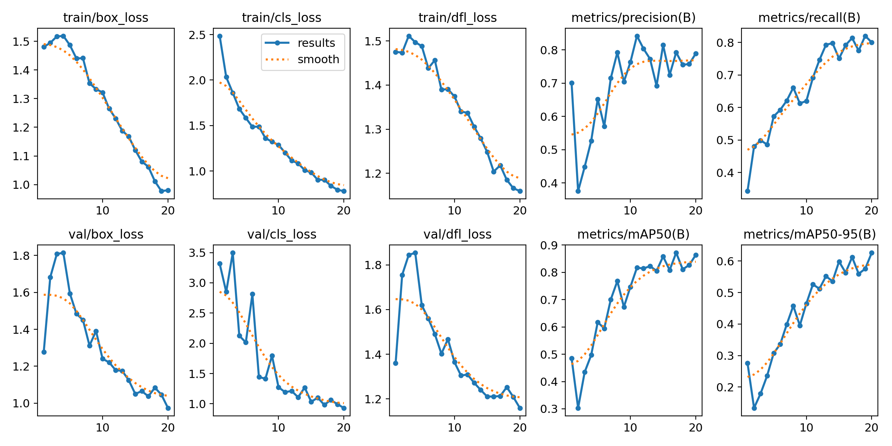
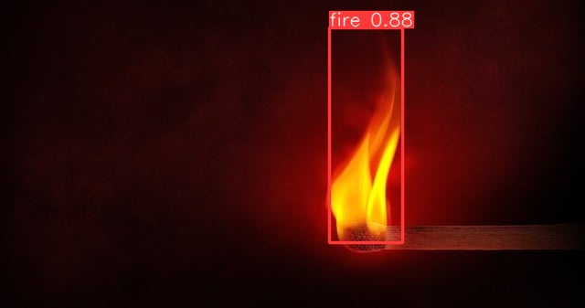

# Real-Time Fire Detection System

I built this computer vision project to detect fire in real time using a trained YOLOv8 model and a live webcam feed. When fire is detected, the system can trigger an alarm sound and send an SOS email notification.


## Features

- Real-time fire detection using a webcam
- Fire detection using a trained YOLOv8 model
- Alarm trigger when fire is detected
- Optional email alert support through environment variables
- Saved training results, plots, and model weights

## Quick Start

```bash
pip install -r requirements.txt
python fire_detection.py
```

Press `q` to close the webcam window.

## How It Works

The main script I wrote does the following:

1. Loads a trained YOLOv8 model.
2. Opens the default webcam.
3. Runs detection on each captured frame.
4. Triggers an alarm when fire is detected.
5. Sends an SOS email notification the first time a detection occurs.

## Requirements

To run the project, install Python 3.9+ and the dependencies from `requirements.txt`:

```bash
pip install -r requirements.txt
```

I also use Python's built-in `smtplib` module for email alerts.

## Environment Variables

Email alerts are optional. If you want to enable them, set the following environment variables:

```bash
FIRE_ALERT_SENDER_EMAIL=your-email@example.com
FIRE_ALERT_RECEIVER_EMAIL=recipient@example.com
FIRE_ALERT_APP_PASSWORD=your-app-password
```

You can use `.env.example` as a template.
## Running the Project

From the project folder, run:

```bash
python fire_detection.py
```

Press `q` to quit the webcam window.

The script expects:

- model weights at `weights/best.pt`
- an alarm file at `assets/alarm.mp3`

## Demo Assets

I included saved training and prediction outputs in `artifacts/`, including:

- evaluation curves and confusion matrices
- labeled training and validation batches
- sample prediction output under `artifacts/runs/detect/predict/`

### Training Results Preview



### Sample Prediction



## Model Files

The trained model weights for this project are stored in:

- `weights/best.pt` - best-performing checkpoint
- `weights/last.pt` - final training checkpoint

I trained the model with YOLOv8n for 20 epochs at an image size of 640, based on the settings saved in `training/train_args.yaml`.

## Training Results

I included the generated evaluation artifacts from training, including:

- confusion matrices
- precision/recall/F1 curves
- batch preview images
- `artifacts/results.csv` and `artifacts/results.png`

From the final logged epoch in `artifacts/results.csv`, the model achieved approximately:

- Precision: 0.789
- Recall: 0.800
- mAP50: 0.864
- mAP50-95: 0.626
